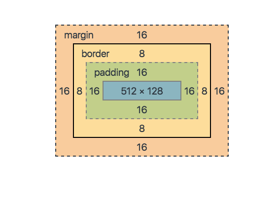
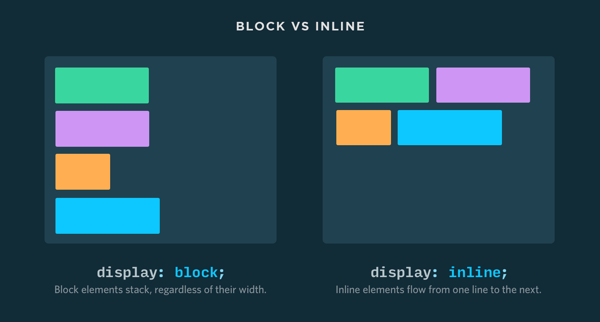

# Aula CSS Posicionando elementos

## Box Model

Todos os elementos renderizados tem o seu box model.

**Box model** é a referência de medidas de um elemento no HTML. Isso inclui largura, altura, espaçamentos internos, externos e a bordas.

O box model faz o "soma" das propriedades de medias, espaçamentos e borda para renderizar um elemento na tela. Fazendo a soma de cada medida



### Manipulando o Box Model

A propriedade para manipular as medidas do seu box model são:

* width (max-width, min-width)
* height (max-height, min-height)
* padding (padding-top, padding-right, padding-bottom, padding-left)
* border (border-width)
* margin

## Elementos inline e block

### Elementos block

São os elementos que tem um comportamento de um "bloco de linha" de texto

### Elementos inline

são os elementos que tem um comportamento de uma parte de uma "linha" de texto



## Manilpulando elementos inline/block

Utilizando a propriedado `display` do CSS você consegue manipular a forma como o elemento irá se comportar na tela. Segue alista de alguns dos tipos de displays utilizados no CSS

* **inline**
* **block**
* **inline-block**
* **none**
* **flex**
* **inline-flex**
* **grid**
* **inline-grid**
* *table*
* *table-cell*
* *list-item*
* *inline-table*
* *table-column*
* *table-column-group*
* *table-footer-group*
* *table-header-group*
* *table-row*
* *table-row-group*

## Position Property

A propriedade `position` define qual a posição dos elementos na tela. Essa propriedade pode ser combinada com as propriedades `top`, `right`, `bottom` e `left` para mudar os eixos da posição do elementos e `z-index` para manipular a posição no "eixo-z" (profundidade do elemento, algo parecido com as layers do Photoshop)

### Exeplo de position

````scss
.elemento {
  position: relative;
  left: 10px;
  z-index: 2;
}
```
````
